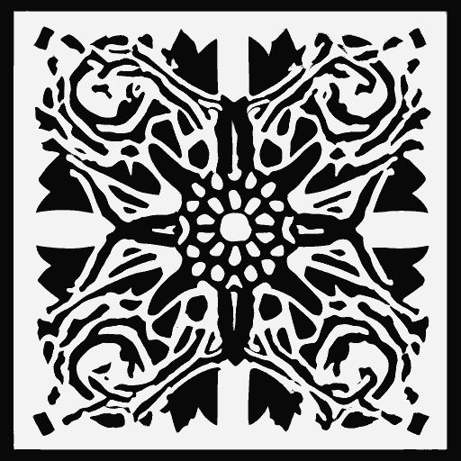

Eldritch Stencil
=================================================

<kbd>

</kbd>

##  A templated static blog generator in Nim

# Introduction

Eldritch Stencil is a simple generator for blog posts using markdown sources. It allows customization of the post template that is used.

# License

Stencil is free to use, modify, and distribute under the terms of the BSD 3-Clause Clear License. See [LICENSE.md](LICENSE.md) for details.

# Examples

## Initialize blog

```
stencil --path_prefix=blog init --title="My new awesome blog"
```
After running this you can edit the .cfg file inside the directory (in this case blog). You can also take a look at the file inside the subdirectory templates (in this case blog/templates/) to customise the HTML.

## Create new post

```
stencil --path_prefix=blog new --title="A post about cool stuff"
```

After running this you can edit the .md file that is outputed after the command.

## Generate HTML files + RSS

```
stencil --path_prefix=blog gen
```

# Usage

```
Usage: stencil [option] command

for options:
        --path_prefix=path      The path to the blog (otherwise ./).
        --help                  print this help.

where command is one of:
        init --title="your blog title"  Creates the structure for a new static blog.
        new --title="your post title"   Creates the files for a new post.
        gen                             (Re-)generates the html pages and rss.
```
# Building

## Building Dependencies
- Linux or WSL 
- Internet connection (for package downloads)
- nim 1.6.0+ with nimble (use [choosenim](https://nim-lang.org/install_unix.html))

## Building

```
nimble build
```  

# Installing 

WIP
